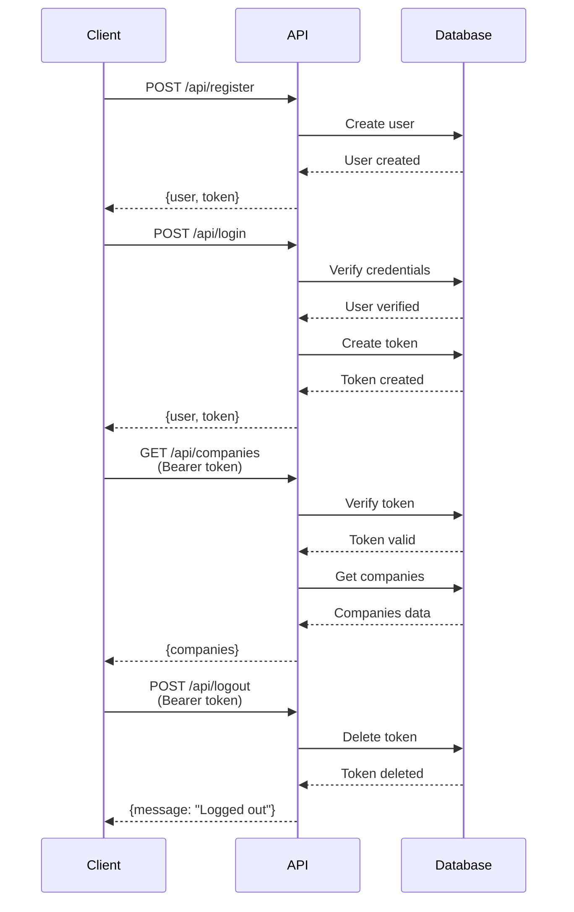

# 🔐 Laravel API - Token Authentication Guide

## ✅ Token Authentication is NOW ACTIVE!

All API endpoints (except login and register) now require a Bearer token for access.

---

## 🚀 Quick Start

### 1. Register a New User
```bash
curl -X POST "http://127.0.0.1:8001/api/register" \
  -H "Content-Type: application/json" \
  -H "Accept: application/json" \
  -d '{
    "name": "John Doe",
    "email": "john@example.com",
    "password": "Password123!",
    "password_confirmation": "Password123!",
    "role": "buyer"
  }'
```

**Response:**
```json
{
  "success": true,
  "message": "Registration successful",
  "data": {
    "user": {...},
    "email_sent": true
  }
}
```

### 2. Login to Get Token
```bash
curl -X POST "http://127.0.0.1:8001/api/login" \
  -H "Content-Type: application/json" \
  -H "Accept: application/json" \
  -d '{
    "email": "john@example.com",
    "password": "Password123!"
  }'
```

**Response:**
```json
{
  "success": true,
  "message": "Login successful",
  "data": {
    "user": {...},
    "token": "22|OSRs8LlKRMmMEUNLTS3DibyJnHeD1G6yPHDAX7al53478617"
  }
}
```

**Save the token!** You'll need it for all other API requests.

### 3. Use Token to Access Protected Endpoints
```bash
curl -X GET "http://127.0.0.1:8001/api/companies" \
  -H "Accept: application/json" \
  -H "Authorization: Bearer 22|OSRs8LlKRMmMEUNLTS3DibyJnHeD1G6yPHDAX7al53478617"
```

---

## 📊 Endpoint Categories

### 🟢 PUBLIC Endpoints (No Token Required)
- `POST /api/register` - Register new user
- `POST /api/login` - Login and get token

### 🔒 PROTECTED Endpoints (Token Required)
All other endpoints require `Authorization: Bearer {token}` header:

- Search, Companies, Compounds, Units
- Stages, Sales, Statistics
- Favorites, Saved Searches
- User Profile, Change Password
- Finish Specs, Unit Types, Unit Areas
- Share Links, Logout

---

## 🔑 Token Usage Examples

### Example 1: Get Companies
```bash
curl -X GET "http://127.0.0.1:8001/api/companies" \
  -H "Authorization: Bearer YOUR_TOKEN_HERE" \
  -H "Accept: application/json"
```

### Example 2: Search Units
```bash
curl -X GET "http://127.0.0.1:8001/api/search?search=villa&type=unit" \
  -H "Authorization: Bearer YOUR_TOKEN_HERE" \
  -H "Accept: application/json"
```

### Example 3: Filter Units
```bash
curl -X POST "http://127.0.0.1:8001/api/filter-units" \
  -H "Authorization: Bearer YOUR_TOKEN_HERE" \
  -H "Content-Type: application/json" \
  -H "Accept: application/json" \
  -d '{
    "usage_type": "Villa",
    "min_price": 5000000,
    "max_price": 20000000
  }'
```

### Example 4: Get User Profile
```bash
curl -X GET "http://127.0.0.1:8001/api/profile" \
  -H "Authorization: Bearer YOUR_TOKEN_HERE" \
  -H "Accept: application/json"
```

### Example 5: Logout
```bash
curl -X POST "http://127.0.0.1:8001/api/logout" \
  -H "Authorization: Bearer YOUR_TOKEN_HERE" \
  -H "Accept: application/json"
```

---

## 📱 Using in Mobile Apps / Frontend

### JavaScript/Axios Example
```javascript
// Login and save token
const loginResponse = await axios.post('http://127.0.0.1:8001/api/login', {
  email: 'john@example.com',
  password: 'Password123!'
});

const token = loginResponse.data.data.token;
localStorage.setItem('api_token', token);

// Use token in subsequent requests
const companiesResponse = await axios.get('http://127.0.0.1:8001/api/companies', {
  headers: {
    'Authorization': `Bearer ${token}`,
    'Accept': 'application/json'
  }
});
```

### React Native / Fetch Example
```javascript
// Login
const loginResponse = await fetch('http://127.0.0.1:8001/api/login', {
  method: 'POST',
  headers: {
    'Content-Type': 'application/json',
    'Accept': 'application/json'
  },
  body: JSON.stringify({
    email: 'john@example.com',
    password: 'Password123!'
  })
});

const { data } = await loginResponse.json();
const token = data.token;

// Use token
const response = await fetch('http://127.0.0.1:8001/api/companies', {
  headers: {
    'Authorization': `Bearer ${token}`,
    'Accept': 'application/json'
  }
});
```

### Flutter/Dart Example
```dart
// Login
final loginResponse = await http.post(
  Uri.parse('http://127.0.0.1:8001/api/login'),
  headers: {
    'Content-Type': 'application/json',
    'Accept': 'application/json',
  },
  body: jsonEncode({
    'email': 'john@example.com',
    'password': 'Password123!',
  }),
);

final token = jsonDecode(loginResponse.body)['data']['token'];

// Use token
final response = await http.get(
  Uri.parse('http://127.0.0.1:8001/api/companies'),
  headers: {
    'Authorization': 'Bearer $token',
    'Accept': 'application/json',
  },
);
```

---

## 🔐 Token Management Best Practices

### 1. Store Tokens Securely
- **Web:** Use `localStorage` or `sessionStorage`
- **Mobile:** Use secure storage (Keychain/Keystore)
- **Never** commit tokens to version control

### 2. Token Lifecycle
```javascript
// Login - Get and store token
const token = await login(email, password);
localStorage.setItem('api_token', token);

// Use token
const data = await fetchWithToken('/api/companies', token);

// Logout - Remove token
await logout(token);
localStorage.removeItem('api_token');
```

### 3. Handle Token Expiration
```javascript
async function apiRequest(url, token) {
  const response = await fetch(url, {
    headers: {
      'Authorization': `Bearer ${token}`,
      'Accept': 'application/json'
    }
  });

  if (response.status === 401) {
    // Token expired or invalid
    // Redirect to login
    window.location.href = '/login';
  }

  return response.json();
}
```

---

## 📋 Postman Setup

### 1. Create Environment Variable
1. In Postman, click "Environments"
2. Create new environment "Laravel API"
3. Add variable: `token` (leave value empty initially)
4. Add variable: `base_url` = `http://127.0.0.1:8001/api`

### 2. Login Request
- **Method:** POST
- **URL:** `{{base_url}}/login`
- **Headers:**
  - `Content-Type: application/json`
  - `Accept: application/json`
- **Body (raw JSON):**
```json
{
  "email": "john@example.com",
  "password": "Password123!"
}
```
- **Tests Tab** (Auto-save token):
```javascript
const response = pm.response.json();
if (response.data && response.data.token) {
    pm.environment.set("token", response.data.token);
}
```

### 3. Protected Requests
- **Method:** GET/POST/PUT/DELETE
- **URL:** `{{base_url}}/companies`
- **Headers:**
  - `Authorization: Bearer {{token}}`
  - `Accept: application/json`

---

## ⚙️ Technical Details

### What Was Set Up:

1. **Laravel Sanctum Installed**
   - Package: `laravel/sanctum v4.2.0`
   - Personal Access Tokens enabled

2. **User Model Updated**
   - Added `HasApiTokens` trait
   - Enables token generation

3. **Auth Controller**
   - `login()` - Returns token in response
   - `register()` - Returns token in response
   - `logout()` - Revokes current token

4. **API Routes Protected**
   - All routes wrapped in `auth:sanctum` middleware
   - Except: `/register` and `/login`

5. **Middleware Configuration**
   - Stateful API enabled in `bootstrap/app.php`
   - Sanctum authentication active

### Token Format:
```
{id}|{plaintext_token}
Example: 22|OSRs8LlKRMmMEUNLTS3DibyJnHeD1G6yPHDAX7al53478617
```

### Database Tables:
- `personal_access_tokens` - Stores issued tokens
- `users` - User accounts

---

## 🧪 Testing Token Authentication

### Test 1: Login and Get Token
```bash
TOKEN=$(curl -s -X POST "http://127.0.0.1:8001/api/login" \
  -H "Content-Type: application/json" \
  -H "Accept: application/json" \
  -d '{"email":"test@example.com","password":"Password123!"}' \
  | grep -o '"token":"[^"]*"' \
  | cut -d'"' -f4)

echo "Token: $TOKEN"
```

### Test 2: Use Token
```bash
curl -X GET "http://127.0.0.1:8001/api/companies" \
  -H "Authorization: Bearer $TOKEN" \
  -H "Accept: application/json"
```

### Test 3: Logout (Revoke Token)
```bash
curl -X POST "http://127.0.0.1:8001/api/logout" \
  -H "Authorization: Bearer $TOKEN" \
  -H "Accept: application/json"
```

---

## 🚨 Error Responses

### Missing Token
**Request without Authorization header:**
```bash
curl -X GET "http://127.0.0.1:8001/api/companies"
```

**Response:**
```json
{
  "message": "Unauthenticated."
}
```
**Status:** 401 Unauthorized

### Invalid Token
**Request with wrong/expired token:**
```bash
curl -X GET "http://127.0.0.1:8001/api/companies" \
  -H "Authorization: Bearer invalid_token_here"
```

**Response:**
```json
{
  "message": "Unauthenticated."
}
```
**Status:** 401 Unauthorized

### Wrong Credentials
**Login with wrong password:**
```bash
curl -X POST "http://127.0.0.1:8001/api/login" \
  -H "Content-Type: application/json" \
  -d '{"email":"test@example.com","password":"WrongPassword"}'
```

**Response:**
```json
{
  "message": "The provided credentials are incorrect.",
  "errors": {
    "email": ["The provided credentials are incorrect."]
  }
}
```
**Status:** 422 Unprocessable Entity

---

## 📊 Complete API Flow



---

## ✅ Summary

**✓ Token authentication is fully configured and working**

### Public Endpoints:
- POST `/api/register`
- POST `/api/login`

### All Other Endpoints Require:
```
Authorization: Bearer {your_token_here}
```

### Get Token From:
- Login response: `response.data.token`
- Register response: `response.data.token` (if using AuthController)

### Use Token In:
- Header: `Authorization: Bearer {token}`
- All protected API requests

---

## 📞 Quick Reference

**Login:**
```bash
POST /api/login
Body: {"email":"...", "password":"..."}
Returns: {"data": {"token": "..."}}
```

**Use Token:**
```bash
GET /api/companies
Header: Authorization: Bearer {token}
```

**Logout:**
```bash
POST /api/logout
Header: Authorization: Bearer {token}
```

---

**Your API is secured with token authentication!** 🎉
